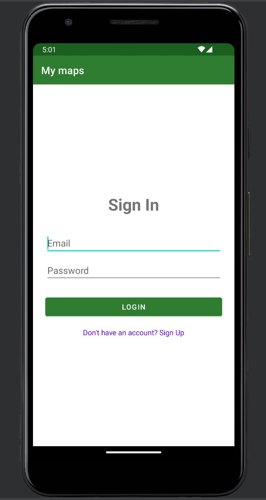
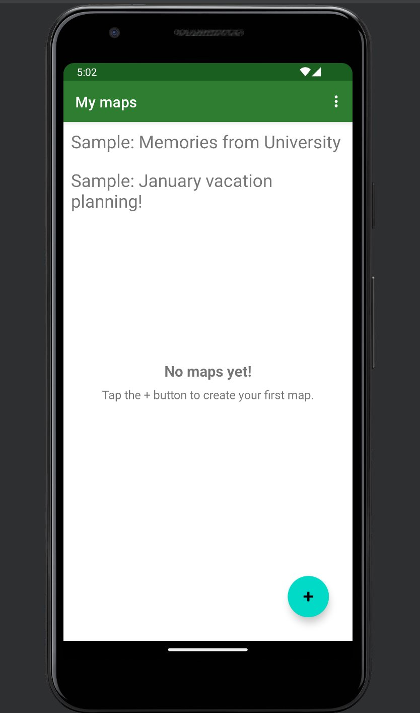
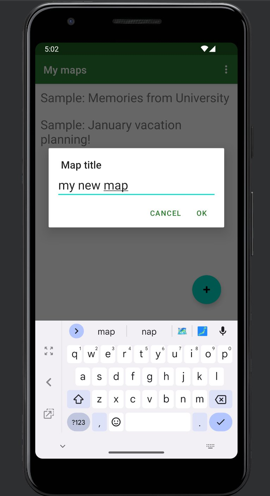
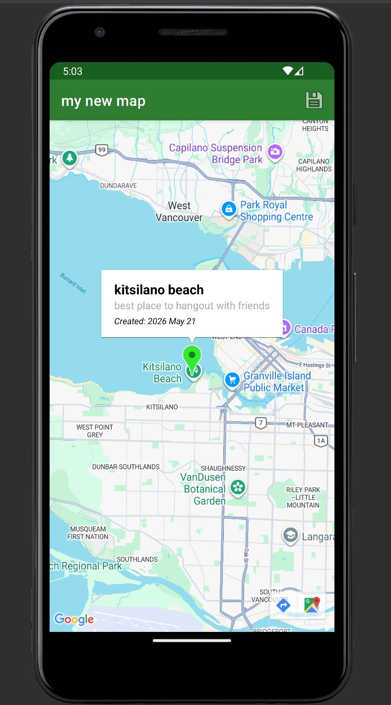
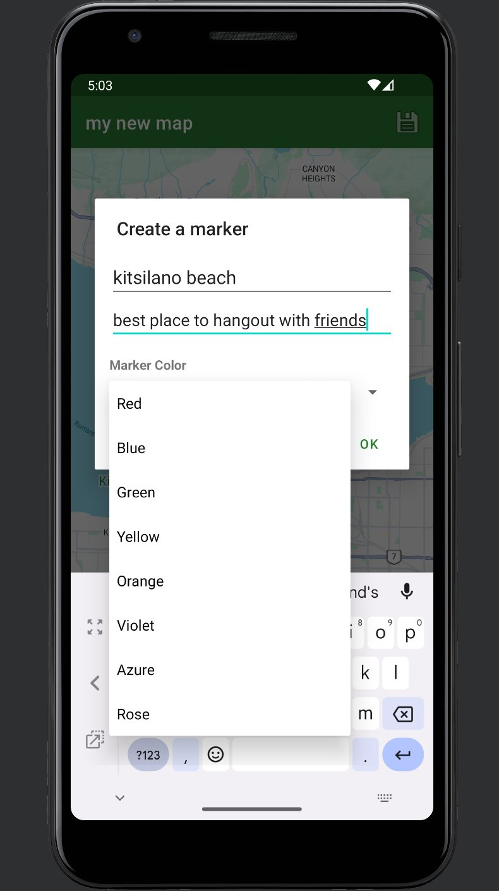

# 📍 MyMaps — Personalized Cloud Map Journal
 
> A full-stack Android application for creating and managing geo-tagged memory journals, built with Kotlin, Google Maps SDK, and Firebase.
 
[](https://kotlinlang.org/)
[](https://firebase.google.com/)
[](https://developers.google.com/maps/documentation/android-sdk)
[](https://developer.android.com/)
 
---
 
## Screenshots
 
| Sign In | My Maps | Create Map |
|:-------:|:-------:|:----------:|
|  |  |  |
 
| Map View | Create Marker |
|:--------:|:-------------:|
|  |  |
 
---
 
## About the Project
 
Most mapping apps are built for navigation. MyMaps is built for **memory**.
 
There's no easy way to annotate a map with personal context. why a place matters, when you visited, or what it meant. MyMaps solves this by combining interactive Google Maps with a personal cloud database, letting users pin locations with custom notes, colors, and timestamps  organized into named trip collections.
 
Built as my first solo Android project to learn the full mobile stack: UI layout, Activity lifecycle, cloud architecture, and auth security.
 
---
 
## Features
 
- **Secure Auth** — Email/password login & signup via Firebase Auth
- **Live Interactive Maps** — Long-press anywhere to drop a custom pin with a name and note
- **Marker Customization** — Choose from 8 marker colors via a custom dialog
- **Real-time Cloud Sync** — All maps stored in Firestore; instantly available on any device
- **Dynamic Editing** — Revisit saved maps to add or remove markers at any time
- **Auto-Timestamping** — Every pin automatically records its creation date
- **Onboarding** — Empty-state UI + auto-generated sample maps for new users
---
 
## Tech Stack
 
| Layer | Technology |
|-------|-----------|
| Language | Kotlin |
| UI Framework | XML Layouts + View Binding + Material Components |
| Maps API | Google Maps SDK for Android |
| Authentication | Firebase Authentication |
| Database | Cloud Firestore (NoSQL) |
| Build System | Gradle (Kotlin DSL) + Version Catalogs (TOML) |
 
---
 
##  Architecture
 
### App Flow
 
```
┌─────────────────────────────────────────┐
│       LoginActivity / SignupActivity     │
│         (Firebase Auth)                 │
└────────────────────┬────────────────────┘
                     │
                     ▼
┌─────────────────────────────────────────┐
│              MainActivity               │
│   RecyclerView + MapsAdapter            │
│                                         │
│   [FAB +] ──────────────────────────┐   │
│   [Tap map] ──────────────────────┐ │   │
│   [Long-press map] → Delete       │ │   │
└───────────────────────────────────│─│───┘
                                    │ │
                    ┌───────────────┘ │
                    ▼                 ▼
     ┌──────────────────┐   ┌──────────────────────────┐
     │ CreateMapActivity│   │    DisplayMapActivity     │
     │  (name input →   │   │  Live map, long-press to  │
     │   Firestore)     │   │  place markers, custom    │
     └──────────────────┘   │  info windows, save to   │
                            │  Firestore               │
                            └──────────────────────────┘
```
 
### Key UI Components
 
| Component | Where | Purpose |
|-----------|-------|---------|
| `RecyclerView` + `MapsAdapter` | `MainActivity` | Drives the dynamic list of saved maps |
| `SupportMapFragment` | `DisplayMapActivity` | Core container for the Google Map instance |
| Custom `InfoWindowAdapter` | `DisplayMapActivity` | Custom XML layout for multi-line marker popups with timestamps |
| `AlertDialog` + `Spinner` | `DisplayMapActivity` | Color picker for marker creation |
| `ProgressBar` | `MainActivity` | Loading state during Firestore reads |
 
### Firestore Schema
 
```
maps/{mapDocumentId}
  ├── title: String
  ├── userId: String
  └── places: Array [
        ├── title, description: String
        ├── latitude, longitude: Double
        ├── colorHue: Float
        └── creationTimestamp: Long
      ]
```
 
---
 
## Key Engineering Decisions
 
**Array fields for markers** — Markers are stored as an array inside the map document rather than a subcollection. This minimizes Firestore reads and ensures atomic updates of an entire trip in a single write.
 
**HUE-based color storage** — Colors are stored as `Float` values (0.0–360.0) matching `BitmapDescriptorFactory` constants directly, so they can be passed straight to the Maps SDK with no conversion logic.
 
**`@DocumentId` annotation** — Bound to the Kotlin data class so the Firestore document ID is automatically available, making targeted deletes clean without storing a separate ID field.
 
---
 
## Challenges & Solutions
 
| Challenge | Solution |
|-----------|----------|
| Passing `UserMap` objects between Activities | Implemented `Serializable` on the model and passed via `Intent` extras |
| Map appearing blank on first run | Diagnosed via Logcat — Maps SDK and Identity Toolkit API needed enabling in Cloud Console |
| Default info window capped at 2 lines | Built a custom `InfoWindowAdapter` with a dedicated XML layout |
| Users not knowing how to create maps | Added a `Snackbar` hint and wired `OnLongClickListener` for creation |
 
---
 
## Setup
 
1. Clone the repo and open in Android Studio
2. Create a Firebase project → enable **Auth (Email/Password)** and **Firestore**
3. Download `google-services.json` → place in `/app`
4. Enable the **Maps SDK for Android** in the Google Cloud Console
5. Add your Maps API key to `local.properties`:
   ```
   MAPS_API_KEY=your_key_here
   ```
6. Build and run
---
 
## Lessons Learned
 
- Android's Activity lifecycle causes real bugs — async callbacks can fire on already-destroyed activities
- NoSQL schema design has real performance tradeoffs that need to be decided upfront
- Firestore security rules are not optional — they are the authorization layer
- Logcat is the most valuable debugging tool in the Android ecosystem
---
 
## Roadmap
 
- [ ] Route drawing between markers
- [ ] Photo uploads via Firebase Storage
- [ ] Collaborative maps — share a trip with a friend
---
 
*Built with ☕ and a lot of Logcat scrolling.*
 
